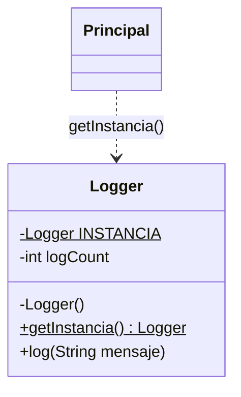

# Patrón 1. Singleton

## Objetivo

Reconocer el patrón Singleton, entender qué problema resuelve comparando
código sin el patrón y con el patrón, y decidir cuándo conviene usarlo y
cuándo no.

## El patrón en breve

Singleton garantiza que una clase tenga una sola instancia y ofrece un
punto de acceso global a ella (Gamma et al., 1994). Sirve cuando varias
partes del programa necesitan compartir el mismo recurso, como un registro
de eventos o una conexión a la base de datos.

En Java, el constructor privado impide crear instancias desde fuera y un
método estático entrega siempre la misma.



El mismo diagrama en PlantUML, con su exportación a SVG, está en
`diagramas/` por si quieres comparar cuál se lee mejor.

## Cuándo sí y cuándo no

Un patrón no es obligatorio. Usarlo donde no hace falta es agregar
complicación sin beneficio, que es justo la "sobre ingeniería" de la que
habla el primer tema de la unidad. Singleton es útil cuando compartir una
sola instancia es un requisito del problema. Si solo es una comodidad para
no pasar un objeto de una parte a otra, conviene pensarlo dos veces.

## Archivos

```
01 - Singleton/
├── README.md
├── java/
│   ├── sin-patron/        Logger.java y Principal.java
│   └── con-patron/        Logger.java, Principal.java y ConError.java
├── c/                     optativo, para comparar con otro lenguaje
│   ├── sin_patron.c
│   └── con_patron.c
├── diagramas/             el diagrama de Java en PlantUML (.puml y .svg)
└── referencia-csharp/     versión original en C#, solo de consulta
```

Los programas no llevan acentos a propósito, para evitar problemas de
codificación en la consola de Windows.

## Práctica en Java (30 min, en equipo)

Antes de ejecutar cada programa, escribe en tu `REFLEXION.md` qué crees que
va a imprimir. Comparar tu predicción con el resultado es lo más valioso de
la práctica.

1. **Sin patrón.** Lee `java/sin-patron/Logger.java` y `Principal.java`.
   Predice qué números aparecerán en los dos mensajes `LOG` y qué dirá la
   comprobación final. Compila con `javac Logger.java Principal.java`,
   ejecuta con `java Principal` y compara. ¿Qué problema ves?
2. **Con patrón.** Lee `java/con-patron/Logger.java` y `Principal.java`.
   Predice qué cambiará en la salida y en qué momento aparecerá el mensaje
   "se creo la unica instancia" respecto a "Iniciando aplicacion". Compila,
   ejecuta y compara.
3. **Intentar romperlo.** En `con-patron`, compila `ConError.java` con
   `javac ConError.java` y lee el mensaje de error. ¿Qué línea de `Logger`
   es la responsable?
4. **Comparar.** Los dos `Principal.java` casi son iguales. ¿Qué línea
   cambió? ¿Qué dos cosas se agregaron a `Logger` para que ese cambio
   bastara?

## Optativo. Comparar con C (15 min)

C no tiene clases, pero la misma necesidad existe. Si quieren contrastar,
hagan lo siguiente.

1. Compila y ejecuta `c/sin_patron.c` y `c/con_patron.c`. Desde la
   terminal sería `gcc sin_patron.c -o sin_patron`, o usa tu IDE.
2. En `con_patron.c`, declara `Logger copia;` junto a las otras variables
   de `main`. Después de obtener `logger1`, escribe `copia = *logger1;` y
   registra un evento en `copia` con `logger_log(&copia, "...");`.
   ¿Compila? ¿Hubo algún aviso?
3. ¿Qué línea de la versión Java no tiene equivalente en C? ¿Qué
   consecuencia tiene eso?

## Aquí ya lo usaste sin darte cuenta

En el [Taller de Arquitecturas de Software](https://github.com/carevalomx69/Taller-de-Arquitecturas-de-Software)
hay tres lugares donde se comparte una sola conexión. Nadie escribió la
palabra Singleton ni usó un constructor privado, pero la idea es la misma.

| Práctica | Archivo | Qué hace |
|---|---|---|
| 3. Capas / MVC | `03-capas-mvc/backend/db.js` | Crea la conexión una vez y los modelos la importan. Node guarda el módulo en memoria, así que todos reciben la misma |
| 4. Hexagonal | `04-hexagonal/backend/index.js` | Crea la conexión una vez y se la entrega al resto de la aplicación |
| 6. Orientado a eventos | `06-orientado-a-eventos/servicio-tareas/adapters/eventPublisher.js` | Abre la conexión la primera vez que se necesita y después la reutiliza |

Ábrelos y léelos. Piensa por qué en JavaScript no hizo falta una clase con
constructor privado.

## Qué deberías observar

- Sin el patrón, cada `new` produce un objeto independiente, y cada uno
  lleva su propia cuenta.
- Con el patrón, no se puede crear otro con `new` desde fuera, y el
  compilador lo avisa.
- Lo que el patrón agrega a la clase es poco, pero cambia cómo se usa.
- La misma necesidad se resuelve de maneras distintas según el lenguaje o
  la arquitectura.

## Errores comunes

| Problema | Causa probable | Solución |
|---|---|---|
| `class Logger is public, should be declared in a file named Logger.java` | El nombre del archivo no coincide con el de la clase pública | Cada clase pública va en un archivo con su mismo nombre |
| `cannot find symbol` al compilar `Principal.java` | Falta compilar `Logger.java` junto con él | Usa `javac Logger.java Principal.java` |
| `javac` no se reconoce como comando | El JDK no está instalado o no está en el PATH | Usa el IDE de tu curso de Java |
| `gcc` no se reconoce como comando | El compilador no está en el PATH | Usa el IDE de tu curso de C |

## Entregable

Un `REFLEXION.md` con lo siguiente.

1. Tus predicciones de los pasos 1 y 2, y lo que realmente ocurrió.
2. El mensaje de error del paso 3.
3. Un párrafo individual de unas 150 palabras. Responde si usarías
   Singleton en el gestor de tareas del Taller y en qué situación no lo
   usarías. Apóyalo con al menos una observación de la práctica.

No se califica que el código compile ni que las predicciones acierten. Se
valora la calidad del razonamiento y la evidencia que lo sostiene.

## Referencias

Gamma, E., Helm, R., Johnson, R. y Vlissides, J. (1994). *Design Patterns:
Elements of Reusable Object-Oriented Software*. Addison-Wesley.
