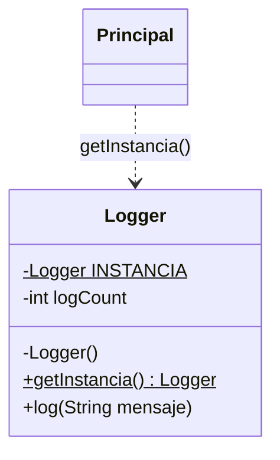
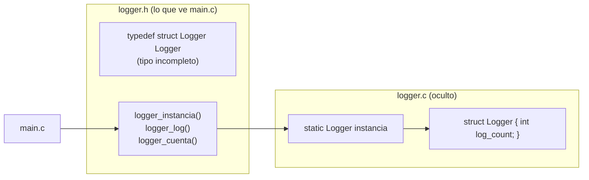
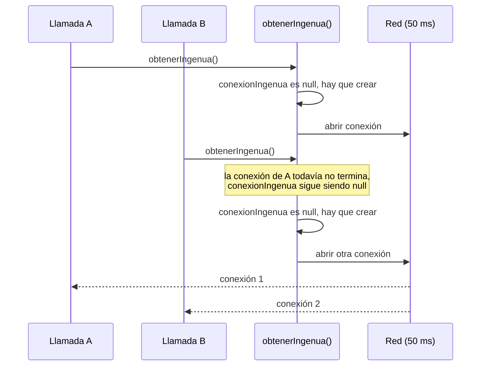
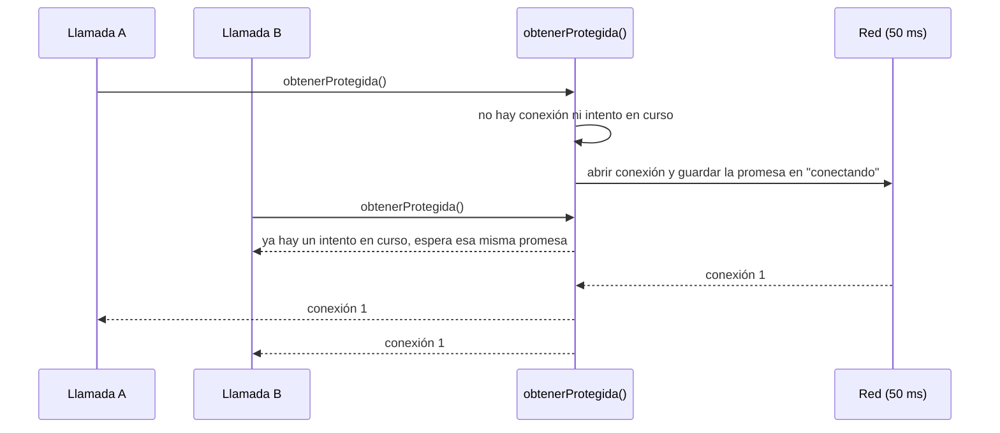

# Patrón 1. Singleton, ¿cuánto del patrón sobrevive?

## Objetivo

Reconocer el patrón Singleton en tres escalas, que son un lenguaje
procedural (C), un lenguaje orientado a objetos (Java) y una arquitectura
web (el Taller de Arquitecturas), y evaluar en cada una cuánto del patrón
sobrevive, cuándo se diluye y cuándo conviene usarlo.

## El patrón en breve

Singleton garantiza que una clase tenga una sola instancia y ofrece un
punto de acceso global a ella (Gamma et al., 1994). Se usa cuando varias
partes del programa necesitan compartir el mismo recurso, como un registro
de eventos o una conexión.

Así se ve en Java. El constructor privado impide crear instancias desde
fuera y el método estático entrega siempre la misma.



En C no existen las clases, pero el tipo opaco logra algo parecido. El
encabezado anuncia que `Logger` existe sin decir de qué está hecho, así que
`main.c` solo puede usar punteros.



Los mismos diagramas, escritos en PlantUML y exportados a SVG, están en la
carpeta `diagramas/` para que compares cuál comunica mejor.

## La idea central

Un patrón se diluye cuando el lenguaje o la arquitectura ya resuelve por sí
solo lo que el patrón resolvía. Lo que queda entonces es una convención, o
ya no hace falta nada. En esta práctica sigues una misma necesidad, que es
tener una sola instancia con acceso controlado, a través de tres escalas.

| Escala | Dónde la vas a ver |
|---|---|
| Idioma de un lenguaje | C |
| Clases y objetos | Java |
| Arquitectura | Prácticas 3, 4 y 6 del [Taller de Arquitecturas de Software](https://github.com/carevalomx69/Taller-de-Arquitecturas-de-Software) |

## Qué retomamos del Taller de Arquitecturas

Ya viste, en el Taller, tres maneras distintas de resolver la pregunta de
cómo comparte la aplicación su acceso a la base de datos o al bus de
eventos. Aquí les ponemos nombre y las comparamos con lo que pasa en C y en
Java.

| Práctica del Taller | Qué recordar |
|---|---|
| 3. Capas / MVC | `db.js` crea la conexión y los modelos la importan |
| 4. Hexagonal | `index.js` decide qué tecnología concreta usa el dominio y `test_domain.js` la reemplaza por una falsa |
| 6. Orientado a eventos | `eventPublisher.js` se conecta a RabbitMQ la primera vez que alguien publica |

## Tabla de dilución

Este es el entregable principal. La tabla se llena a lo largo de la
práctica y cada parte te dice qué filas completar. Copia esta tabla en tu
`REFLEXION.md`.

| Caso | ¿Quién garantiza la unicidad? | ¿Cómo se rompe, si se puede? | ¿Qué pasa con varios hilos o varios procesos? | ¿Cómo la sustituyes por una falsa en una prueba? | ¿Cuánto del patrón sobrevive y qué tan sencillo es? |
|---|---|---|---|---|---|
| C, un solo archivo | | | | | |
| C, tipo opaco | | | | | |
| Java | | | | | |
| Taller, Práctica 3 | | | | | |
| Taller, Práctica 4 | | | | | |
| Taller, Práctica 6 | | | | | |

En la última columna escribe una frase con tu juicio. Puedes medir la
sencillez con las líneas de código y con la cantidad de conceptos que
alguien necesita conocer para entender el caso.

## Requisitos previos

- Haber revisado, leyendo el código, las Prácticas 3, 4 y 6 del Taller
  de Arquitecturas. No es necesario volver a correrlas.
- El IDE o el compilador de C que usaste en tu curso de C. Si prefieres la
  terminal, necesitas `gcc`.
- Un JDK instalado. Puedes usar el IDE de tu curso de Java o la terminal
  con `javac` y `java`.
- Node.js instalado en tu máquina. Ya lo necesitaste en la Práctica 4. Si
  tuviste problemas, revisa el `FAQ-TECNICO.md` del Taller.
- Haber revisado el material de clase del patrón Singleton.

## Estructura de archivos

```
01 - Singleton/
├── README.md                          (esta guía)
├── c/
│   ├── singleton_simple.c             todo en un solo archivo
│   ├── logger.h                       tipo opaco, versión en tres archivos
│   ├── logger.c
│   ├── main.c
│   └── main_con_error.c               intenta romper el patrón
├── java/
│   ├── Logger.java
│   ├── Principal.java
│   ├── ConError.java                  intenta romper el patrón
│   └── Carrera.java                   varios hilos contra un Singleton
├── experimentos/
│   ├── conexion.js                    módulo que imita a db.js de la Práctica 3
│   └── experimentos.js                tres experimentos cortos
├── diagramas/                         los mismos diagramas en PlantUML (.puml y .svg)
└── referencia-csharp/                 versión original en C#, solo de consulta
```

Los programas de C y de Java no llevan acentos a propósito, para evitar
problemas de codificación en la consola de Windows.

## Instrucciones paso a paso

Las partes 1 a 5 se hacen en equipo. La parte 6 es individual. Antes de
ejecutar cualquier cosa donde se pida una predicción, escribe en tu
`REFLEXION.md` qué crees que va a pasar. Comparar tu predicción con el
resultado es la parte más valiosa de la práctica.

### Parte 1. El patrón en C (30 min)

1. Compila y ejecuta `c/singleton_simple.c`. Verifica que `logger1` y
   `logger2` apuntan a la misma instancia. Desde la terminal sería
   `gcc singleton_simple.c -o singleton_simple`.
2. Sin cambiar la función `logger_instancia`, encuentra al menos dos
   maneras de conseguir un segundo `Logger` independiente en ese mismo
   programa. Piensa qué operaciones permite C sobre una estructura cuya
   definición está a la vista. ¿Alguna produjo un aviso o un error del
   compilador? Guarda el resultado.
3. Ahora compila la versión de tipo opaco, que está en tres archivos
   (`logger.h`, `logger.c` y `main.c`). En tu IDE crea un proyecto con
   `logger.c` y `main.c`, y deja `logger.h` en la misma carpeta. Desde la
   terminal sería `gcc main.c logger.c -o programa`. Ejecútala.
4. Compila `main_con_error.c` junto con `logger.c` y lee los mensajes del
   compilador. ¿Qué hace distinta a esta versión? ¿Qué parte de C hace aquí
   el trabajo que en otros lenguajes hace un constructor privado?
5. Piensa cómo sustituirías `logger.c` por una versión falsa para pruebas
   sin modificar `main.c`. Describe tu idea. Si te da tiempo, impleméntala.

Completa en la tabla de dilución las dos filas de C.

### Parte 2. El patrón en Java (30 min)

1. Predice en qué momento aparecerá el mensaje de creación del `Logger`
   respecto a la línea "Iniciando aplicacion". Compila con
   `javac Logger.java Principal.java`, ejecuta con `java Principal` y
   compara.
2. Compila `ConError.java` con `javac ConError.java` y lee el error.
   Compáralo con el de C.
3. Antes de ejecutar `Carrera.java`, predice cuántas instancias distintas
   verán los hilos y cuánto valdrá cada contador al final. Compila con
   `javac Carrera.java`, ejecuta con `java Carrera` al menos cuatro veces y
   anota todos los valores.
4. Explica con tus palabras qué garantiza este Singleton y qué no garantiza,
   usando lo que viste en `Carrera`.
5. Investiga si existe alguna forma de crear una segunda instancia a pesar
   del constructor privado. Si la encuentras, pruébala.

Completa en la tabla de dilución la fila de Java.

### Parte 3. Cacería de instancias únicas sin nombre (35 min)

Abre el código del Taller de Arquitecturas y completa las tres filas del
Taller en la tabla de dilución. Estos son los archivos que debes abrir en
cada una.

| Práctica | Archivos a abrir |
|---|---|
| 3 | `03-capas-mvc/backend/db.js` y `models/taskModel.js` |
| 4 | `04-hexagonal/backend/index.js` y `adapters/dbAdapter.js` |
| 6 | `06-orientado-a-eventos/servicio-tareas/adapters/eventPublisher.js` e `index.js` |

Para la primera columna tus opciones son la clase, el compilador, el
módulo, el cableado de la aplicación (el lugar donde se arma todo) o nadie.

La definición clásica del patrón contiene dos ideas distintas. La primera
es que existe una sola instancia de la clase. La segunda es que hay un
punto de acceso global a ella (Gamma et al., 1994). Para cada fila de la
tabla, incluidas las de C y Java, indica en la última columna cuál de las
dos ideas está presente, cuál no, y si el sistema se beneficia de tener las
dos juntas.

### Parte 4. Tres experimentos (25 min)

Entra a la carpeta `experimentos/`. Para cada experimento, escribe tu
predicción, ejecútalo y anota qué observaste.

```
node experimentos.js 1
node experimentos.js 2
node experimentos.js 3
```

**Experimento 1.** Importa el mismo módulo dos veces y compara las
referencias. Después borra la entrada del módulo del caché de Node y vuelve
a importarlo. Observa que `conexion.js` no tiene constructor privado ni
método de acceso. ¿Qué mecanismo es entonces el que da la unicidad?

**Experimento 2.** Diez partes del programa piden la conexión al mismo
tiempo, antes de que la primera termine de abrirse. Compara la versión
ingenua con la versión protegida. Después busca la variable `connecting`
en `eventPublisher.js` (Práctica 6) y explica con qué versión del
experimento se parece y qué problema está evitando. Por último, compara
este experimento con la carrera de Java de la Parte 2. ¿Es el mismo
problema? ¿En qué se parecen y en qué se diferencian?

**Experimento 3.** Se lanzan tres procesos de Node que importan el mismo
módulo. Con esto en mente, responde lo siguiente.

- Cada pool de la Práctica 6 se crea con `connectionLimit: 10`. En esa
  práctica, `servicio-tareas` y `servicio-usuarios` usan cada uno su
  propio pool contra el mismo MySQL.
- El Taller usa la imagen `mysql:8.0`. Según un artículo de
  [Percona](https://www.percona.com/blog/dealing-with-too-many-connections-error-in-mysql-8/)
  sobre MySQL 8, el valor por defecto de `max_connections` es 151.
- Si ambos servicios se escalaran a N réplicas cada uno, ¿a partir de qué
  valor de N el máximo teórico de conexiones supera ese límite? Recuerda
  que el máximo teórico es un techo y que un pool no necesariamente abre
  todas sus conexiones.

#### Qué pasa en el experimento 2

Versión ingenua. La segunda llamada llega mientras la primera todavía
espera a la red, y para ella la conexión aún no existe.



Versión protegida. Quien llega después espera la misma promesa que ya
está en curso en lugar de empezar otra.



### Parte 5. Código generado por IA (30 min)

Usa la herramienta de IA que prefieras. Anota en tu `REFLEXION.md` cuál
usaste y la fecha, porque el resultado puede variar de una ocasión a otra.

1. Pide a la IA lo siguiente y guarda el código tal como lo devuelve.

   > Escribe el acceso a base de datos de un gestor de tareas en Node.js usando el patrón Singleton.

2. En una conversación nueva, haz una segunda petición que no menciona
   el patrón.

   > Escribe el acceso a base de datos de un gestor de tareas en Node.js que sea fácil de probar sin una base de datos real.

3. Audita las dos respuestas con estas cinco preguntas, que son las mismas
   columnas de tu tabla de dilución.
   - ¿Quién garantiza la unicidad, si es que hay una?
   - ¿Cómo se podría romper?
   - ¿Qué pasa si hay varios hilos o varias copias del proceso, como en el experimento 3?
   - ¿Se puede reemplazar por una falsa para probar la lógica de negocio, como hace `test_domain.js` en la Práctica 4?
   - ¿Cuánto del patrón sobrevive y qué tan sencillo resultó el código?
4. Con la evidencia de tus dos respuestas, ¿la IA usó Singleton cuando no
   se lo pediste? ¿Cuál de las dos versiones fue más fácil de probar?

Opcional. Repite la primera petición pidiendo la solución en C y en Java,
y compara cuánto del patrón sobrevive en cada una.

### Parte 6. Defender una decisión (15 min, individual)

En un máximo de 250 palabras, responde en tu `REFLEXION.md` si usarías
Singleton en el gestor de tareas del Taller y en qué condiciones no lo
usarías. Si decides que no, indica qué usarías en su lugar. Menciona la
fila de tu tabla de dilución donde el patrón te parece más justificado y la
fila donde te parece más prescindible. Sostén tu postura con al menos una
observación concreta de las partes 1 a 5.

Opcional. Si quieres, escribe una línea sobre dónde aparece algo parecido
en el prototipo de tu equipo y si te parece una buena decisión.

## Qué deberías observar

- La misma necesidad aparece como una variable con disciplina en C, como
  una clase con constructor privado en Java, como un módulo o un cableado
  en una arquitectura web.
- Quien impone la unicidad cambia de un caso a otro. Puede ser el
  compilador, una convención o nadie.
- Que exista una sola instancia no protege los datos que contiene. Esa
  protección es un problema aparte.
- Una sola instancia significa una sola por proceso. Si hay varias copias
  del proceso, el patrón cambia de sentido.
- Quien crea la instancia en un solo lugar y la entrega a quien la
  necesita, como en la Práctica 4, logra la unicidad sin el acceso global
  y conserva la posibilidad de probar con una versión falsa.

## Errores comunes y solución

| Problema | Causa probable | Solución |
|---|---|---|
| `undefined reference to 'logger_instancia'` al compilar en C | Falta agregar `logger.c` al proyecto o a la línea de compilación | Compila `main.c` y `logger.c` juntos |
| `gcc` no se reconoce como comando | El compilador no está en el PATH | Usa el IDE de tu curso de C |
| `class X is public, should be declared in a file named X.java` | El nombre del archivo no coincide con el de la clase pública | Cada clase pública va en un archivo con su mismo nombre |
| `node: command not found` | Node.js no está instalado o la terminal se abrió antes de instalarlo | Ver el `FAQ-TECNICO.md` del Taller de Arquitecturas |
| El experimento 3 no imprime tres líneas | Se ejecutó dentro de un entorno que no permite lanzar procesos hijos | Ejecuta `node experimentos.js 3` desde una terminal normal |

## Criterios de valoración

No se califica que el código compile ni que las predicciones acierten.
Se valora la calidad del razonamiento y la evidencia que lo sostiene.

- Las predicciones están escritas antes de ejecutar y se comparan con lo observado.
- La tabla de dilución se apoya en evidencia concreta, como mensajes del compilador o resultados de ejecución, y no solo en etiquetas.
- La tabla distingue la unicidad del acceso global con argumentos.
- La auditoría de la parte 5 se apoya en lo que la IA realmente devolvió.
- La defensa de la parte 6 menciona al menos una condición en la que la decisión cambiaría.

## Entregable

1. `REFLEXION.md` con tus predicciones, la tabla de dilución completa, tus
   observaciones de la parte 4, la auditoría de la parte 5 y tu defensa de
   la parte 6.
2. Evidencia de las partes 1 y 2, que son los mensajes de error del
   compilador de C y de Java, y los valores de al menos cuatro ejecuciones
   de `Carrera`.
3. Los dos fragmentos de código que devolvió la IA en la parte 5, junto
   con el nombre de la herramienta y la fecha.

## Referencias

Gamma, E., Helm, R., Johnson, R. y Vlissides, J. (1994). *Design Patterns:
Elements of Reusable Object-Oriented Software*. Addison-Wesley.

Percona. (s. f.). *Dealing with "too many connections" error in MySQL 8*.
https://www.percona.com/blog/dealing-with-too-many-connections-error-in-mysql-8/
