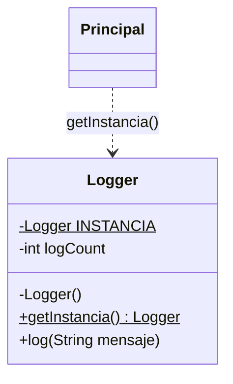

# Patrón 1. Singleton

## Objetivo

Reconocer el patrón Singleton, entender qué problema resuelve comparando
código sin el patrón y con el patrón, y decidir cuándo conviene usarlo y
cuándo no.

## El patrón en breve

Singleton garantiza que una clase tenga una sola instancia y ofrece un
punto de acceso global a ella (Gamma et al., 1994). Sirve cuando varias
partes del programa necesitan compartir el mismo recurso, como un registro
de eventos o una conexión a la base de datos.

En Java, el constructor privado impide crear instancias desde fuera y un
método estático entrega siempre la misma.



## Cuándo sí y cuándo no

Un patrón no es obligatorio. Usarlo donde no hace falta es agregar
complicación sin beneficio, que es justo la "sobre ingeniería" de la que
habla el primer tema de la unidad. Singleton es útil cuando compartir una
sola instancia es un requisito del problema. Si solo es una comodidad para
no pasar un objeto de una parte a otra, conviene pensarlo dos veces.

## Archivos

```
01 - Singleton/
├── README.md
├── java/
│   ├── sin-patron/        Logger.java y Principal.java
│   └── con-patron/        Logger.java y Principal.java
└── referencia-csharp/     versión original en C#, solo de consulta
```

Los programas no llevan acentos a propósito, para evitar problemas de
codificación en la consola de Windows.

## Práctica en Java (20 min)

Antes de ejecutar cada programa, anota qué crees que va a imprimir.
Comparar tu predicción con el resultado es lo más valioso de la práctica.

1. **Sin patrón.** Lee `java/sin-patron/Logger.java` y `Principal.java`.
   Predice qué números aparecerán en los dos mensajes `LOG` y qué dirá la
   comprobación final. Ejecútalo y compara. ¿Qué problema ves?
2. **Con patrón.** Lee `java/con-patron/Logger.java` y `Principal.java`.
   Predice qué cambiará en la salida. Ejecútalo y compara.
3. **Comparar.** Los dos `Principal.java` casi son iguales. ¿Qué línea
   cambió? ¿Qué se agregó a `Logger` para que ese cambio bastara?

### Cómo ejecutar

Desde la terminal, entra a la carpeta de cada versión y ejecuta.

```
cd java/sin-patron
javac Logger.java Principal.java
java Principal
```

Repite con `java/con-patron`. En VS Code, con la extensión de Java, también
puedes abrir `Principal.java` y presionar *Run* sobre el método `main`.
Abre una versión a la vez (menú *File > Open Folder*) para que las dos
clases `Logger` no se confundan entre sí.

## Patrones usados en el taller de arquitecturas (sin haberlos conocido aun)

En el [Taller de Arquitecturas de Software](https://github.com/carevalomx69/Taller-de-Arquitecturas-de-Software)
hay tres lugares donde se comparte una sola conexión. Nadie escribió la
palabra Singleton ni usó un constructor privado, pero la idea es la misma.

| Práctica | Archivo | Qué hace |
|---|---|---|
| 3. Capas / MVC | `03-capas-mvc/backend/db.js` | Crea la conexión una vez y los modelos la importan. Node guarda el módulo en memoria, así que todos reciben la misma |
| 4. Hexagonal | `04-hexagonal/backend/index.js` | Crea la conexión una vez y se la entrega al resto de la aplicación |
| 6. Orientado a eventos | `06-orientado-a-eventos/servicio-tareas/adapters/eventPublisher.js` | Abre la conexión la primera vez que se necesita y después la reutiliza |

Ábrelos y revisa el código. Piensa por qué en JavaScript no hizo falta una
clase con constructor privado.

## Qué gana y qué cuesta usar Singleton

| Aspecto | Sin patrón | Con patrón |
|---|---|---|
| Cuántos `Logger` existen | Tantos como `new` se ejecuten. En la práctica, dos | Uno solo, sin importar cuántas veces se pida |
| La cuenta de eventos | Cada `Logger` cuenta por separado y los dos mensajes salen con `[1]` | Se comparte, y los mensajes salen con `[1]` y `[2]` |
| Quién decide cuándo se crea | Cualquier parte del programa, cuando quiera | La propia clase, una vez |
| Cómo se obtiene el objeto | `new Logger()` | `Logger.getInstancia()` |
| Qué pasa si alguien escribe `new Logger()` | Funciona y crea otro objeto | No compila. El error es `Logger() has private access in Logger` |
| Cambio en el código que lo usa | Ninguno | Una línea por cada `new Logger()` |
| Cambio en la clase `Logger` | Ninguno | Tres piezas, el campo estático, el constructor privado y `getInstancia()` |
| Costo | Ninguno, pero el riesgo de duplicados queda abierto | Todo el programa queda atado al nombre `Logger` y a su acceso global |

La última fila es la razón por la que Singleton se usa con cuidado. Se gana
una garantía de instancia única, y se paga con un acceso global del que
dependen muchas partes del código. Si compartir el objeto es un requisito
del problema, la garantía vale la pena. Si es solo una comodidad, no.

## Errores comunes

| Problema | Causa probable | Solución |
|---|---|---|
| `class Logger is public, should be declared in a file named Logger.java` | El nombre del archivo no coincide con el de la clase pública | Cada clase pública va en un archivo con su mismo nombre |
| `cannot find symbol` al compilar `Principal.java` | Falta compilar `Logger.java` junto con él | Usa `javac Logger.java Principal.java` |
| `javac` no se reconoce como comando | El JDK no está instalado o no está en el PATH | Usa el IDE de tu curso de Java |

## Entregable

Evidencia de que ejecutaste las dos versiones, sin patrón y con patrón.
Puede ser una captura de la salida de cada una o el texto copiado de la
consola, y una línea que diga qué diferencia notaste entre ambas.

Tu predicción no tiene que acertar. Lo que se revisa es que lo ejecutaste y
que observaste la diferencia.

## Referencias

Gamma, E., Helm, R., Johnson, R. y Vlissides, J. (1994). *Design Patterns:
Elements of Reusable Object-Oriented Software*. Addison-Wesley.
