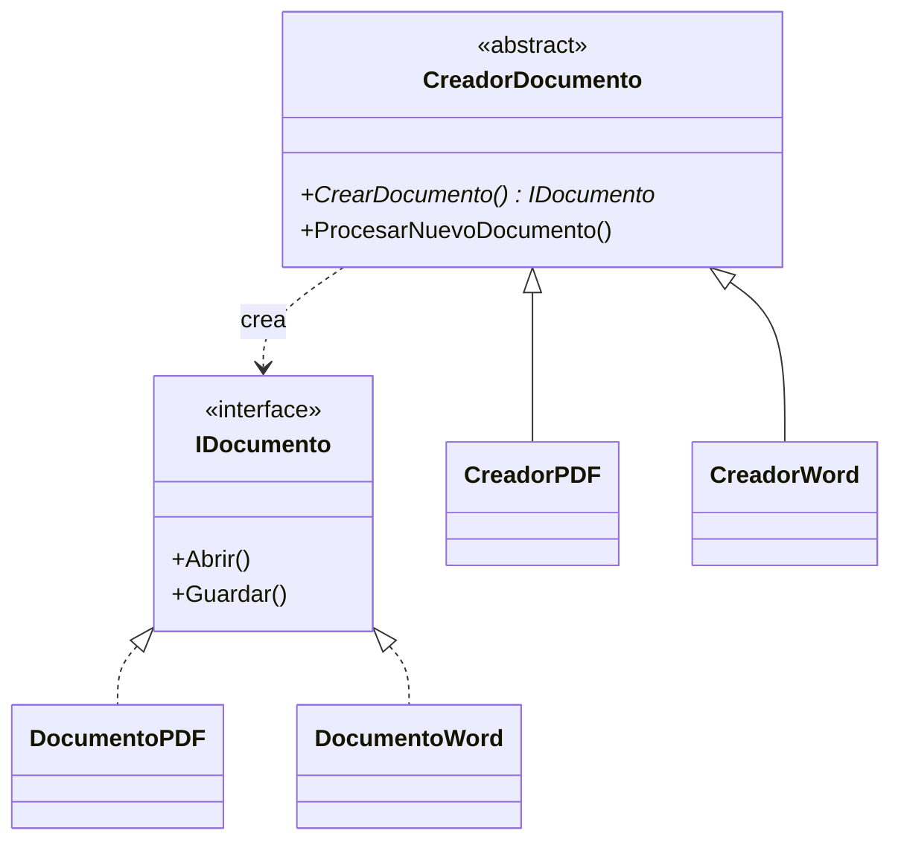

# Patrón 2. Factory Method

> **Estado.** Práctica por rediseñar. Por ahora esta carpeta contiene la
> explicación del patrón y los ejemplos originales en C#. La práctica de
> Singleton ([01 - Singleton](../01%20-%20Singleton/README.md)) muestra el
> formato al que se va a llevar: C, Java y arquitectura, con una tabla de
> contraste.

## El patrón en breve

Define un método para crear objetos y deja que las subclases decidan qué clase concreta instanciar (Gamma et al., 1994). Quien usa el objeto trabaja con una interfaz y no conoce la clase concreta.

## El problema que resuelve

Un código que escribe `new` con clases concretas queda atado a ellas. Agregar un tipo nuevo obliga a modificar el código que ya funcionaba. Con Factory Method, agregar un tipo nuevo es crear una subclase del creador y no tocar el resto.

## Estructura

## Archivos de esta carpeta

Todo está en `referencia-csharp/`. Cada ejemplo con patrón tiene su
contraparte sin patrón, para comparar.

| Archivo | Qué muestra |
|---|---|
| `program.cs` | Factory Method clásico con creadores abstractos (`CreadorPDF`, `CreadorWord`) |
| `calculoViabilidad.cs` | Una fábrica con `switch` que devuelve estrategias de cálculo (VPN, TIR) |
| `calculoViabilidad.js` y `documentCreator.js` | Las mismas ideas en JavaScript |
| `factory.puml` | Diagrama del ejemplo de documentos |

Los archivos `.puml` generan los diagramas con PlantUML.

## Idea para la práctica rediseñada

En C, una función que recibe un tipo y devuelve un puntero a una estructura con sus funciones. En Java, la versión clásica con subclases. En el Taller de Arquitecturas, buscar dónde se decide qué implementación concreta se usa. Los ejemplos en JavaScript de esta carpeta ya sirven de punto de partida.

## Referencias

Gamma, E., Helm, R., Johnson, R. y Vlissides, J. (1994). *Design Patterns:
Elements of Reusable Object-Oriented Software*. Addison-Wesley.
