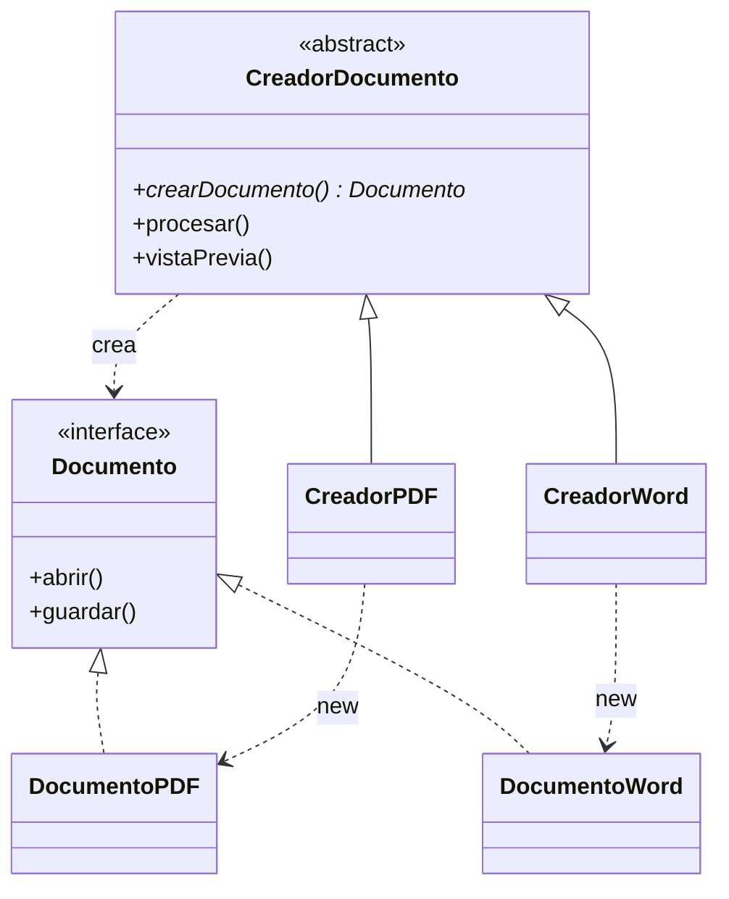

# Patrón 2. Factory Method

## Objetivo

Reconocer el patrón Factory Method, ver qué cambia en el código al usarlo
frente a un `if/else` que crea los objetos, y decidir cuándo conviene.

## El patrón en breve

Factory Method define un método para crear objetos y deja que las
subclases decidan qué clase concreta instanciar (Gamma et al., 1994). Quien
usa el objeto trabaja con una interfaz y no conoce la clase concreta.

El problema que resuelve es este. Un código que escribe `new` con clases
concretas queda atado a ellas. Si hay que agregar un tipo nuevo, se modifica
código que ya funcionaba, y si la decisión de qué crear se repite en varias
funciones, hay que modificarlas todas.

Un ejemplo cotidiano es una aplicación que procesa documentos en PDF o en
Word. Las piezas son cuatro.

- **Producto.** La interfaz que el programa necesita (`Documento`).
- **Producto concreto.** Cada formato real (`DocumentoPDF`, `DocumentoWord`).
- **Creador.** Una clase abstracta con el *factory method* (`crearDocumento()`)
  y con la lógica que lo usa (`procesar()`, `vistaPrevia()`).
- **Creador concreto.** Cada subclase decide qué producto crear
  (`CreadorPDF`, `CreadorWord`).



## Cuándo sí y cuándo no

Con solo dos formatos y una función que los crea, un `if/else` es más
simple y suficiente. Montar creadores abstractos ahí es la sobreingeniería
de la que habla el README general. Factory Method empieza a valer la pena
cuando se cumple alguna de estas situaciones.

- La decisión de qué clase crear se repite en varias partes del programa.
- Se espera de verdad que aparezcan tipos nuevos.
- La lógica que usa el objeto (`procesar()`) es la misma para todos los tipos
  y no conviene copiarla.

También conviene distinguirlo de la "fábrica simple", muy común, que es una
función con un `switch` que devuelve el objeto, como la de
`referencia-csharp/calculoViabilidad.cs`. Es útil y sencilla, pero no es uno
de los 23 patrones del catálogo, que solo describe Factory Method y Abstract
Factory como patrones de creación por fábricas (Gamma et al., 1994).

## Archivos

```
02 - Factory_Method/
├── README.md
├── java/
│   ├── sin-patron/        Documento, DocumentoPDF, DocumentoWord y Principal
│   └── con-patron/        los mismos tres más CreadorDocumento, CreadorPDF,
│                          CreadorWord y Principal
└── referencia-csharp/     versión original en C#, solo de consulta
```

Los programas no llevan acentos a propósito, para evitar problemas de
codificación en la consola de Windows.

## Práctica en Java (20 min)

Antes de ejecutar cada programa, anota qué crees que va a imprimir.
Comparar tu predicción con el resultado es lo más valioso de la práctica.

1. **Sin patrón.** Lee `java/sin-patron/Principal.java`. Fíjate en cuántas
   veces aparece `new DocumentoPDF()`. Predice la salida y ejecútalo.
2. **Con patrón.** Lee `java/con-patron/CreadorDocumento.java`,
   `CreadorPDF.java` y `Principal.java`. Fíjate en cuántas veces aparece
   `new DocumentoPDF()` ahora. Predice qué líneas nuevas aparecerán en la
   salida y ejecútalo.
3. **Comparar.** Las dos versiones imprimen casi lo mismo. Si piden agregar
   un formato Excel, ¿qué archivos habría que modificar en cada versión?

### Cómo ejecutar

Desde la terminal, entra a la carpeta de cada versión. Aquí se compilan
todos los archivos juntos con el comodín `*.java`.

```
cd java/sin-patron
javac *.java
java Principal
```

Repite con `java/con-patron`. En VS Code, abre una versión a la vez (menú
*File > Open Folder*), porque las dos carpetas tienen clases con el mismo
nombre.

## Qué gana y qué cuesta usar Factory Method

| Aspecto | Sin patrón | Con patrón |
|---|---|---|
| Dónde aparece `new DocumentoPDF()` | En dos funciones de `Principal`, una por cada `if/else` | En un solo lugar, `CreadorPDF` |
| Dónde se escribe la lógica de procesar | Dentro de `Principal`, mezclada con la decisión de qué crear | En `CreadorDocumento`, una sola vez y separada de esa decisión |
| Quién conoce las clases concretas | `Principal`, que depende de todas | Solo cada creador concreto. `procesar()` trabaja con `Documento` |
| Agregar el formato Excel | Crear `DocumentoExcel` y modificar `Principal` en dos lugares | Crear `DocumentoExcel` y `CreadorExcel`. `procesar()` y `vistaPrevia()` no cambian |
| Código existente que se modifica | Sí | Ninguna clase existente. Solo se agrega la línea que elige `new CreadorExcel()` |
| Clases en total | 4 | 7 |
| Costo | Ninguno al inicio, pero crece con cada tipo y cada función que lo necesite | Más clases y más indirección desde el primer día |

La fila de costo es la que decide. Para dos formatos y una sola función, la
versión sin patrón es más corta y más clara. El patrón se paga solo cuando
los tipos o las funciones empiezan a multiplicarse.

Así se vería agregar Excel con el patrón. No hace falta tocar ninguna de las
clases anteriores.

```java
public class DocumentoExcel implements Documento {
    public void abrir()   { System.out.println("DocumentoExcel: abriendo archivo XLSX."); }
    public void guardar() { System.out.println("DocumentoExcel: guardando datos en formato XLSX."); }
}

public class CreadorExcel extends CreadorDocumento {
    @Override
    public Documento crearDocumento() { return new DocumentoExcel(); }
}
```

## Patrones usados en el taller de arquitecturas (sin haberlos conocido aun)

En el [Taller de Arquitecturas de Software](https://github.com/carevalomx69/Taller-de-Arquitecturas-de-Software)
no hay un Factory Method textual, con subclases creadoras. Lo que sí
aparece es la misma motivación, que es separar la decisión de qué
implementación concreta se usa de la lógica que la utiliza. Aquí se
resuelve con funciones de creación, que es lo habitual en JavaScript.

| Práctica | Archivo | Qué hace |
|---|---|---|
| 4. Hexagonal | `04-hexagonal/backend/index.js` | Es el único lugar que decide qué tecnología concreta usa el dominio. Crea el adaptador de base de datos con `createDbAdapter(pool)` y se lo entrega a `createApiAdapter` |
| 4. Hexagonal | `04-hexagonal/backend/adapters/dbAdapter.js` | `createDbAdapter(pool)` construye y devuelve un objeto con las operaciones que el dominio espera, sin que el dominio sepa que por dentro hay MySQL |
| 4. Hexagonal | `04-hexagonal/backend/test_domain.js` | `createFakeRepo()` crea un repositorio falso, en memoria, con las mismas operaciones. El dominio funciona igual con uno que con otro |

Ábrelos y revisa el código. Piensa qué tendría que cambiar en `domain/` si
mañana se usara otra base de datos, y compáralo con la tabla de arriba.

## Errores comunes

| Problema | Causa probable | Solución |
|---|---|---|
| `cannot find symbol` al compilar | Se compiló solo un archivo y faltan los demás | Usa `javac *.java` dentro de la carpeta |
| `class X is public, should be declared in a file named X.java` | El nombre del archivo no coincide con el de la clase pública | Cada clase pública va en un archivo con su mismo nombre |
| `javac` no se reconoce como comando | El JDK no está instalado o no está en el PATH | Usa el IDE de tu curso de Java |

## Entregable

Evidencia de que ejecutaste las dos versiones, sin patrón y con patrón.
Puede ser una captura de la salida de cada una o el texto copiado de la
consola, y una línea que diga qué diferencia notaste entre ambas.

Tu predicción no tiene que acertar. Lo que se revisa es que lo ejecutaste y
que observaste la diferencia.

## Referencias

Gamma, E., Helm, R., Johnson, R. y Vlissides, J. (1994). *Design Patterns:
Elements of Reusable Object-Oriented Software*. Addison-Wesley.
