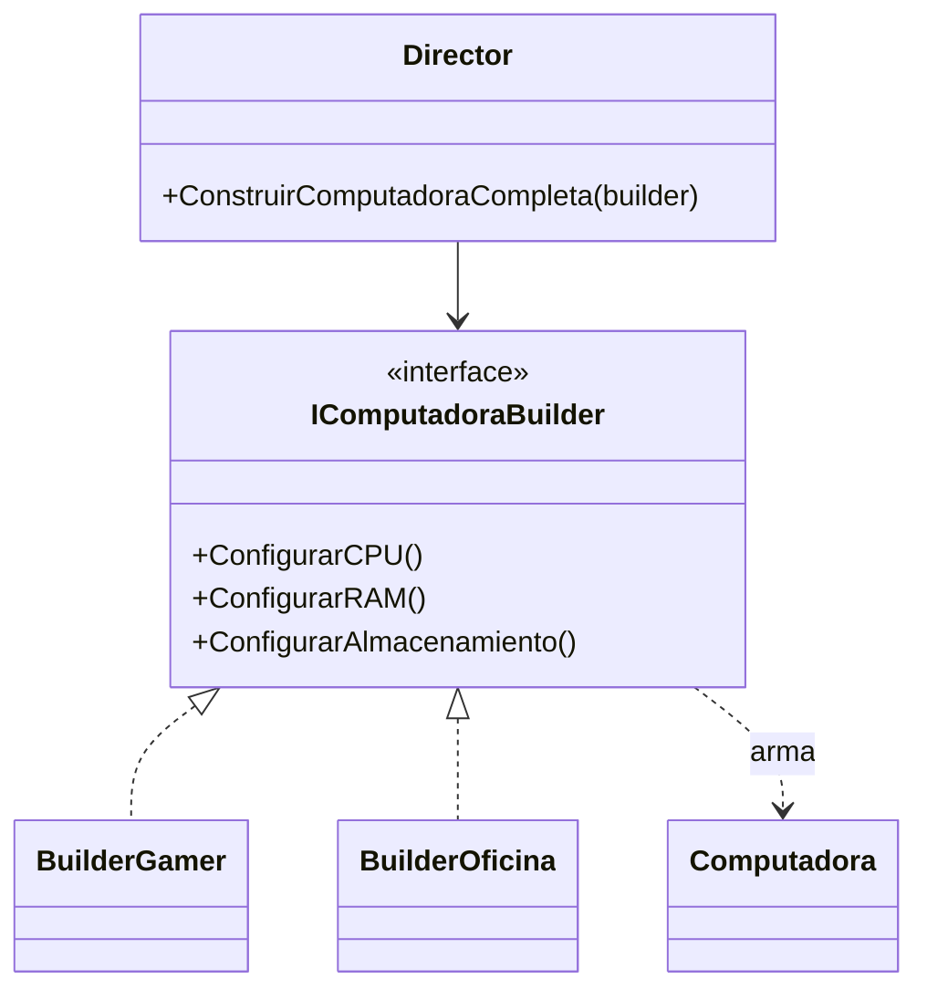

# Patrón 3. Builder

> **Estado.** Práctica por rediseñar. Por ahora esta carpeta contiene la
> explicación del patrón y los ejemplos originales en C#. La práctica de
> Singleton ([01 - Singleton](../01%20-%20Singleton/README.md)) muestra el
> formato al que se va a llevar: C, Java y arquitectura, con una tabla de
> contraste.

## El patrón en breve

Separa la construcción de un objeto complejo de su representación, de modo que el mismo proceso pueda producir configuraciones distintas (Gamma et al., 1994).

## El problema que resuelve

Cuando un objeto tiene muchas partes opcionales, aparecen los constructores telescópicos, con una lista larga de argumentos que hay que pasar en orden, a veces con `null` en los huecos. Builder arma el objeto paso a paso y un director puede repetir recetas conocidas.

## Estructura

## Archivos de esta carpeta

Todo está en `referencia-csharp/`. Cada ejemplo con patrón tiene su
contraparte sin patrón, para comparar.

| Archivo | Qué muestra |
|---|---|
| `Program.cs` | Builder con `BuilderGamer`, `BuilderOficina` y un `Director` |
| `notBuilder.cs` | El anti-patrón, con constructores telescópicos |
| `BuilderClassUML.puml`, `BuilderSequenceUML.puml`, `BuilderUMLClassDetailed.puml` | Diagramas del patrón |
| `BuilderClassAntipatern.puml`, `BuilderSequenceAntipatern.puml` | Diagramas del anti-patrón |

Los archivos `.puml` generan los diagramas con PlantUML.

## Idea para la práctica rediseñada

Este patrón es buen candidato para el contraste por dilución. En C, los inicializadores designados de C99 permiten nombrar los campos al crear una estructura, y buena parte del problema desaparece. En Java, el patrón sigue siendo útil. Queda por explorar si aparece algo equivalente en el Taller.

## Referencias

Gamma, E., Helm, R., Johnson, R. y Vlissides, J. (1994). *Design Patterns:
Elements of Reusable Object-Oriented Software*. Addison-Wesley.
