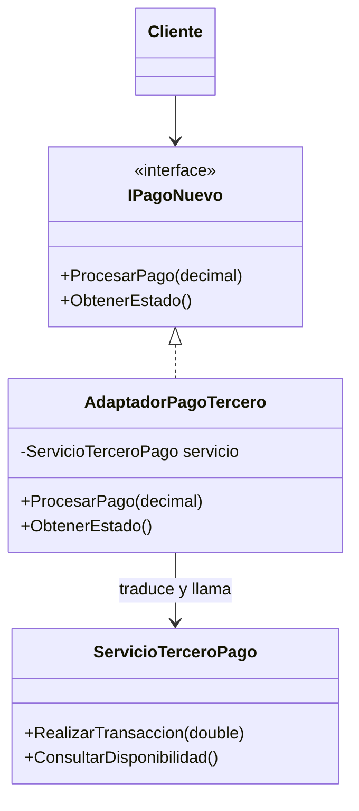

# Patrón 4. Adapter

> **Estado.** Práctica por rediseñar. Por ahora esta carpeta contiene la
> explicación del patrón y los ejemplos originales en C#. La práctica de
> Singleton ([01 - Singleton](../01%20-%20Singleton/README.md)) muestra el
> formato al que se va a llevar: C, Java y arquitectura, con una tabla de
> contraste.

## El patrón en breve

Convierte la interfaz de una clase en otra que el cliente espera, para que clases con interfaces incompatibles puedan trabajar juntas (Gamma et al., 1994).

## El problema que resuelve

Hay código que no se puede o no se debe modificar, como una biblioteca de terceros, y que expone nombres o tipos distintos a los que usa tu sistema. El adaptador traduce, y el resto del sistema queda protegido de esos detalles.

## Estructura

## Archivos de esta carpeta

Todo está en `referencia-csharp/`. Cada ejemplo con patrón tiene su
contraparte sin patrón, para comparar.

| Archivo | Qué muestra |
|---|---|
| `Adapter.cs` | Adaptador que traduce nombres y tipos de datos (de `decimal` a `double`) |
| `noAdapter.cs`, `withoutAdapter.cs` | Dos versiones sin el patrón |
| `adapterClassUML.puml`, `adapterSequenceUML.puml` | Diagramas del patrón |
| `noAdapterClassUML.puml` | Diagrama sin el patrón |

Los archivos `.puml` generan los diagramas con PlantUML.

## Idea para la práctica rediseñada

Es el puente más natural con el Taller de Arquitecturas. Los adaptadores de la Práctica 4 (hexagonal) traducen los errores de la base de datos al lenguaje del dominio, y la Práctica 9 hace lo mismo con otra base de datos sin cambiar el dominio. Falta verificar que los dos adaptadores expongan los mismos métodos antes de apoyar la práctica en esa comparación.

## Referencias

Gamma, E., Helm, R., Johnson, R. y Vlissides, J. (1994). *Design Patterns:
Elements of Reusable Object-Oriented Software*. Addison-Wesley.
