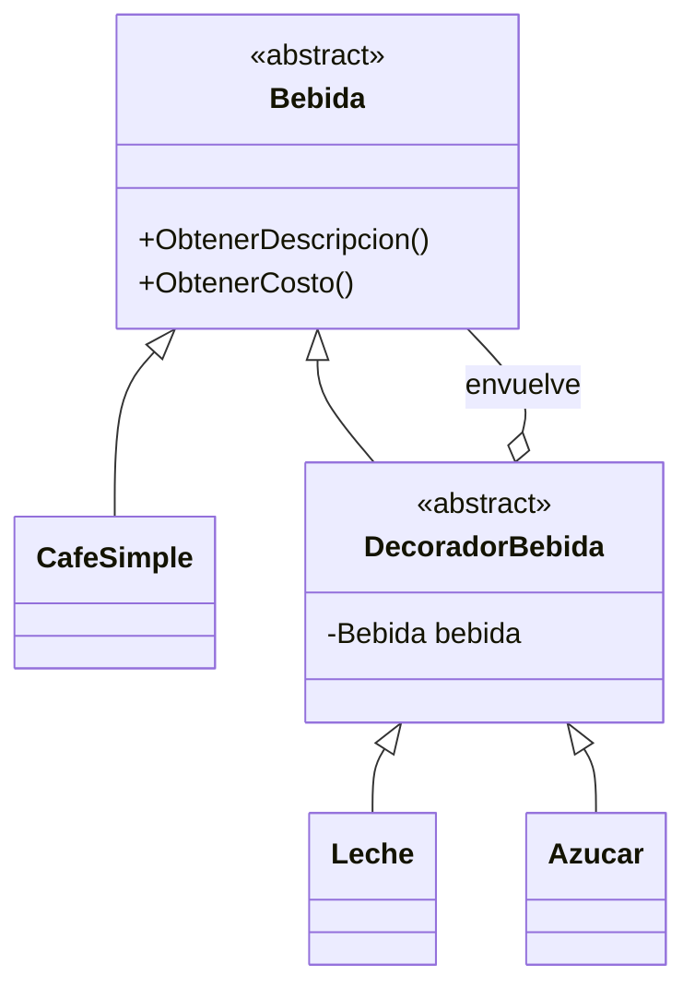

# Patrón 5. Decorator

> **Estado.** Práctica por rediseñar. Por ahora esta carpeta contiene la
> explicación del patrón y los ejemplos originales en C#. La práctica de
> Singleton ([01 - Singleton](../01%20-%20Singleton/README.md)) muestra el
> formato al que se va a llevar: C, Java y arquitectura, con una tabla de
> contraste.

## El patrón en breve

Agrega responsabilidades a un objeto de forma dinámica, envolviéndolo en otros objetos que comparten su misma interfaz (Gamma et al., 1994).

## El problema que resuelve

Si cada combinación de extras necesita su propia subclase, las clases se multiplican con cada opción nueva. Con decoradores, cada extra es una pieza y se combinan en tiempo de ejecución.

## Estructura

## Archivos de esta carpeta

Todo está en `referencia-csharp/`. Cada ejemplo con patrón tiene su
contraparte sin patrón, para comparar.

| Archivo | Qué muestra |
|---|---|
| `Decorator.cs` | Café con decoradores de leche y azúcar |
| `notDecorator.cs` | Una clase por cada combinación, que es el problema |
| `DecoratorUMLClass.puml`, `DecoratorUMLClassWithComments.puml`, `DecoratorUMLSequence.puml` | Diagramas del patrón |
| `notDecoratorUMLClass.puml` | Diagrama sin el patrón |

Los archivos `.puml` generan los diagramas con PlantUML.

## Idea para la práctica rediseñada

Pendiente de explorar. Una posibilidad es buscar en el Taller de Arquitecturas dónde una función envuelve a otra para agregarle comportamiento, y comparar con el patrón.

## Referencias

Gamma, E., Helm, R., Johnson, R. y Vlissides, J. (1994). *Design Patterns:
Elements of Reusable Object-Oriented Software*. Addison-Wesley.
