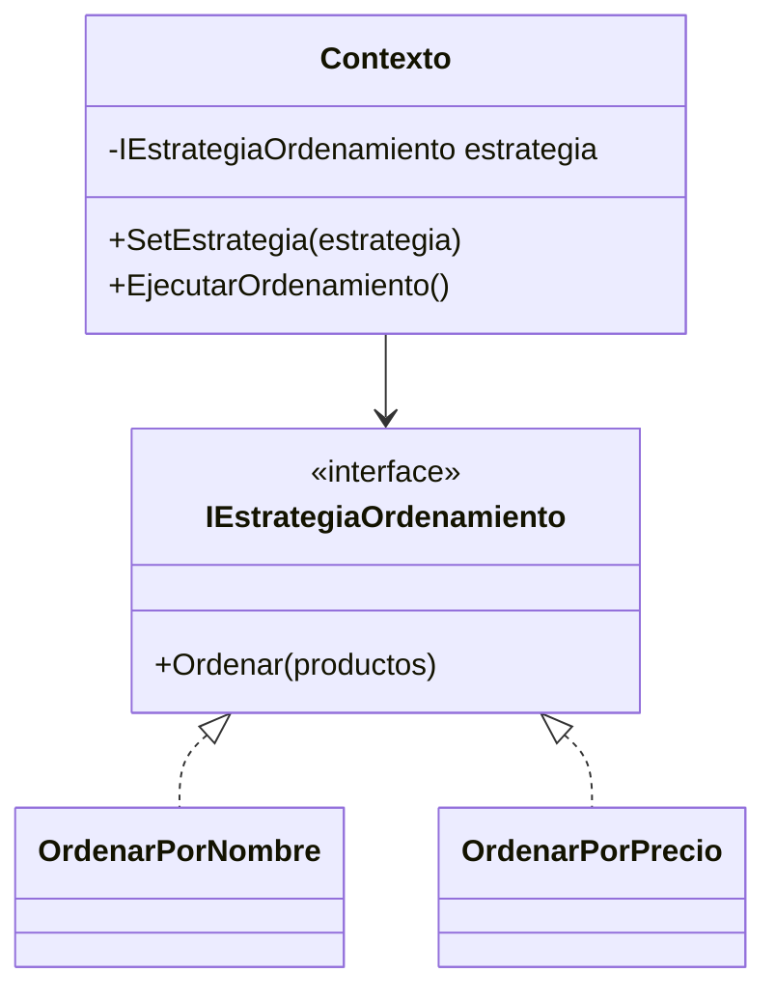

# Patrón 6. Strategy

> **Estado.** Práctica por rediseñar. Por ahora esta carpeta contiene la
> explicación del patrón y los ejemplos originales en C#. La práctica de
> Singleton ([01 - Singleton](../01%20-%20Singleton/README.md)) muestra el
> formato al que se va a llevar: C, Java y arquitectura, con una tabla de
> contraste.

## El patrón en breve

Define una familia de algoritmos, encapsula cada uno y los hace intercambiables, de modo que el algoritmo pueda variar sin que cambie quien lo usa (Gamma et al., 1994).

## El problema que resuelve

Un método con un `switch` o una cadena de `if` que elige el algoritmo crece con cada variante nueva y mezcla responsabilidades. Con Strategy, cada algoritmo vive en su propia clase y el contexto recibe el que debe usar.

## Estructura

## Archivos de esta carpeta

Todo está en `referencia-csharp/`. Cada ejemplo con patrón tiene su
contraparte sin patrón, para comparar.

| Archivo | Qué muestra |
|---|---|
| `strategy.cs` | Ordenamiento por nombre o por precio con estrategias intercambiables |
| `notStrategy.cs` | El mismo problema resuelto con un `switch` dentro del contexto |
| `strategyClassUML.puml`, `strategySequenceUML.puml` | Diagramas del patrón |

Los archivos `.puml` generan los diagramas con PlantUML.

## Idea para la práctica rediseñada

Buen candidato para el contraste por dilución. En C, un apuntador a función cumple el papel de la estrategia, como en `qsort`. En Java, la interfaz y las clases. En el Taller, el dominio recibe su `repo` desde afuera, lo cual guarda parentesco con este patrón.

## Referencias

Gamma, E., Helm, R., Johnson, R. y Vlissides, J. (1994). *Design Patterns:
Elements of Reusable Object-Oriented Software*. Addison-Wesley.
