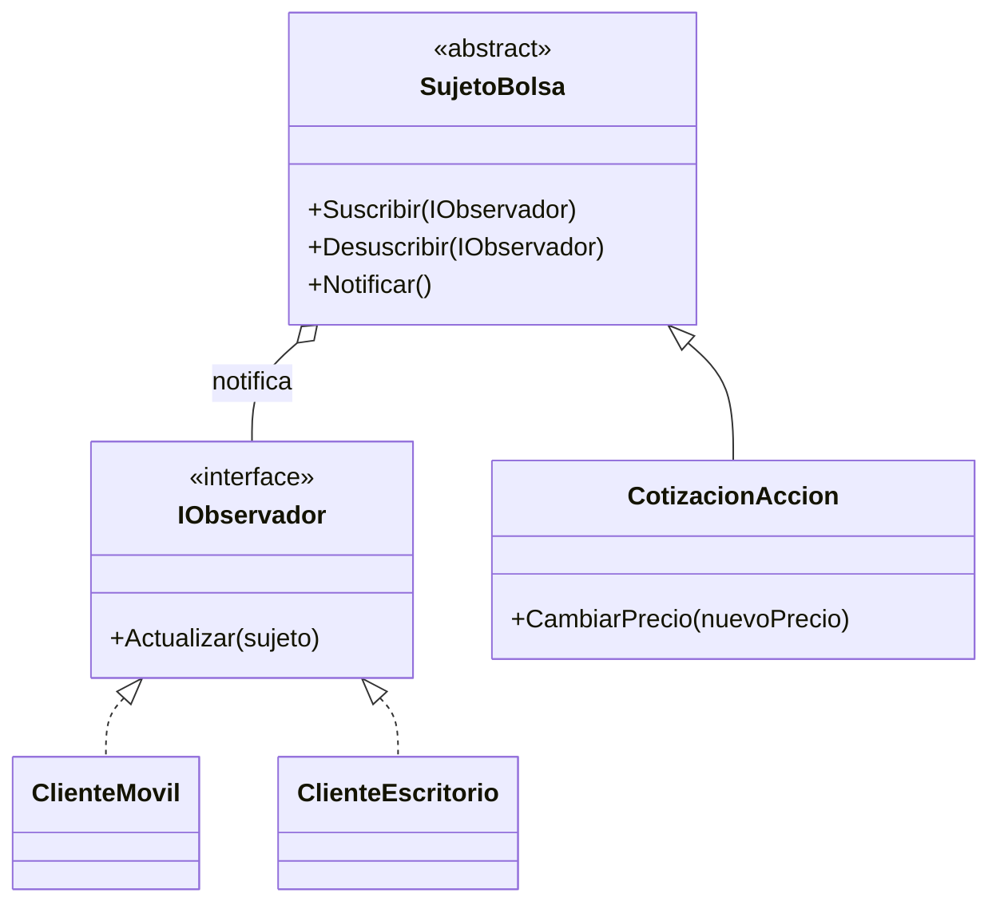

# Patrón 7. Observer

> **Estado.** Práctica por rediseñar. Por ahora esta carpeta contiene la
> explicación del patrón y los ejemplos originales en C#. La práctica de
> Singleton ([01 - Singleton](../01%20-%20Singleton/README.md)) muestra el
> formato al que se va a llevar: C, Java y arquitectura, con una tabla de
> contraste.

## El patrón en breve

Define una dependencia de uno a muchos entre objetos, de modo que cuando uno cambia de estado todos sus dependientes son notificados automáticamente (Gamma et al., 1994).

## El problema que resuelve

Si el objeto que cambia conoce y llama directamente a cada interesado, queda acoplado a todos ellos y agregar o quitar uno exige modificarlo. Con Observer, los interesados se suscriben y el sujeto solo conoce una interfaz.

## Estructura

## Archivos de esta carpeta

Todo está en `referencia-csharp/`. Cada ejemplo con patrón tiene su
contraparte sin patrón, para comparar.

| Archivo | Qué muestra |
|---|---|
| `observer.cs` | Cotización de una acción con clientes móvil y de escritorio suscritos |
| `notObserver.cs` | El sujeto llama directamente a cada cliente concreto |
| `observerClassUML.puml`, `observerSequenceUML.puml` | Diagramas del patrón |
| `notObserverClassUML.puml` | Diagrama sin el patrón |

Los archivos `.puml` generan los diagramas con PlantUML.

## Idea para la práctica rediseñada

Es el puente natural con la Práctica 6 del Taller, orientada a eventos, donde el servicio de tareas publica y otros servicios reaccionan por medio de un bus de mensajes. En C, una lista de funciones de retorno (callbacks) cumple el papel de los observadores.

## Referencias

Gamma, E., Helm, R., Johnson, R. y Vlissides, J. (1994). *Design Patterns:
Elements of Reusable Object-Oriented Software*. Addison-Wesley.
