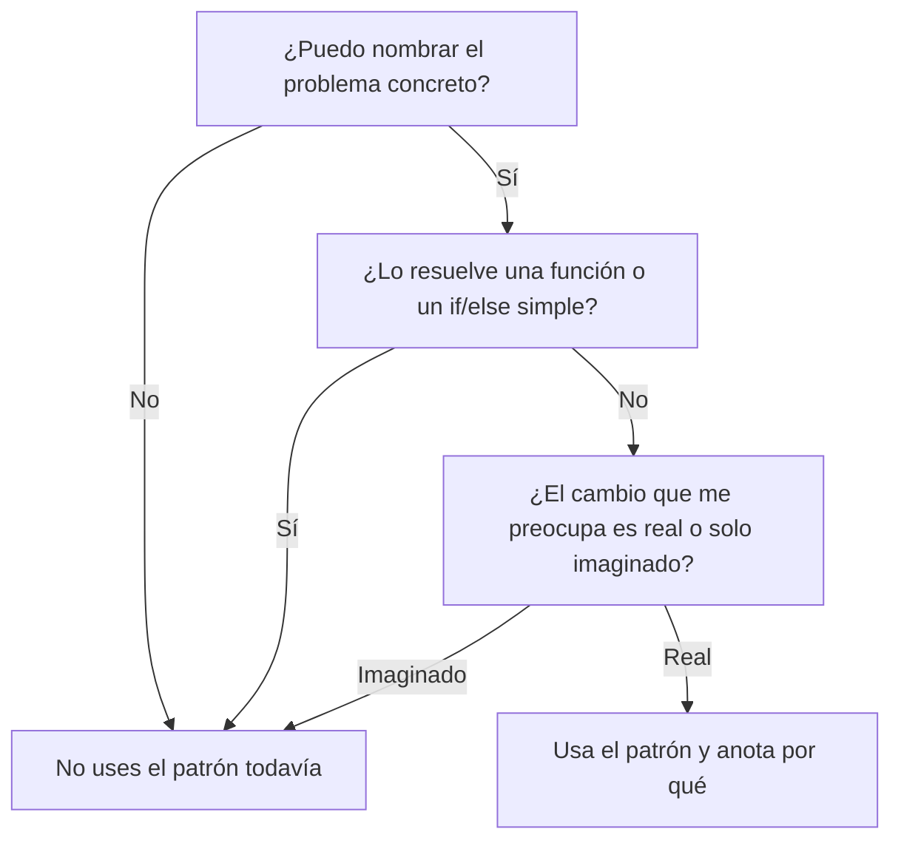

# Patrones de Diseño

Material del curso de Diseño de Software (UAA). Cada carpeta explica un
patrón y reúne los archivos de su práctica. La idea de fondo es aprender a
reconocer un patrón y a evaluar cuándo conviene usarlo, no solamente copiar código.

## ¿Qué es un patrón de diseño?

Un patrón de diseño es una solución general, probada y reutilizable para un
problema que aparece una y otra vez al diseñar software (Gamma et al.,
1994). Trabaja a nivel de código, dentro de un módulo o de unas pocas
clases, y por eso se dice que atiende preocupaciones de escala "micro".
Esto lo distingue de un estilo de arquitectura como capas, hexagonal u
orientada a eventos, que organiza el sistema completo.

Hay tres ideas que ayudan a entenderlos.

- **Un patrón es una plantilla, no código para copiar.** Dice qué piezas
  participan y cómo se relacionan, pero la implementación final depende de
  tu lenguaje y de tu problema. Por eso verás el mismo patrón escrito de
  maneras distintas.
- **Un patrón es un vocabulario compartido.** Decir "aquí usamos un Factory"
  le comunica a todo el equipo una estructura completa en pocas palabras.
- **Un patrón es una respuesta a un problema.** Si no puedes nombrar el
  problema que resuelve, probablemente no lo necesitas todavía.

## Los 23 patrones y sus tres familias

El término "Gang of Four" (GoF) designa a los cuatro autores del libro que
formalizó 23 patrones para software orientado a objetos: Erich Gamma,
Richard Helm, Ralph Johnson y John Vlissides (1994). Los agrupan por el
tipo de problema que atienden.

| Familia | Se ocupa de | Ejemplos en este taller | Otros del catálogo |
|---|---|---|---|
| Creacionales (5) | Cómo, cuándo y quién crea los objetos, para que el código cliente no dependa de ello | Singleton, Factory Method, Builder | Abstract Factory, Prototype |
| Estructurales (7) | Cómo se combinan clases y objetos para formar estructuras mayores | Adapter, Decorator | Facade, Composite, Proxy, Bridge, Flyweight |
| Comportamentales (11) | Cómo se reparten responsabilidades y se comunican los objetos | Strategy, Observer | Command, Iterator, State, Template Method, Mediator, y otros |

El programa de la unidad es amplio. Este taller cubre siete patrones, los
más representativos de cada familia, para que puedas reconocer la lógica
detrás de los demás.

## Un modelo mental. Herramienta, no mandamiento

Un patrón es una herramienta de una caja de herramientas. Un martillo es muy
útil, pero no por eso se usa para atornillar. Aplicar un patrón porque "así
se hace", sin que el problema lo pida, es **sobreingeniería**. El resultado
es código con más clases, más capas y más indirección de las que el problema
necesita, que cuesta más de entender y de mantener sin dar nada a cambio.

Un ejemplo típico es montar un Strategy o un Observer completo para algo que
resuelve un simple `if/else`. Los principios de diseño (SOLID, KISS, YAGNI)
sufren el mismo riesgo cuando se aplican "por la regla" y no por el contexto.
YAGNI, por ejemplo, recuerda que no conviene construir hoy lo que quizá se
necesite mañana (Beck y Andres, 2004). Una recomendación muy difundida es
llegar al patrón refactorizando cuando el código lo pide, en lugar de
partir de él por anticipado (Kerievsky, 2004).

Antes de usar un patrón, hazte estas tres preguntas.



Esto no significa que los patrones hayan perdido valor. Singleton o Factory
Method siguen siendo muy usados. Otros, como Interpreter o Visitor, aparecen
con menos frecuencia y en casos específicos. Lo que se valora hoy es el
criterio de quien diseña, más que la aplicación automática del catálogo.
También influye el lenguaje, pues en lenguajes dinámicos varios patrones se
vuelven más simples o desaparecen como estructura aparte (Norvig, 1996). Lo
verás en la práctica de Singleton, con el caso de JavaScript.

## Cómo está planteado el taller

Cada práctica sigue la misma secuencia, pensada para ser corta.

1. Leer la explicación del patrón en el README de su carpeta.
2. Predecir y luego ejecutar dos versiones de un mismo programa en Java, una
   sin el patrón y otra con el patrón. El código lleva comentarios que
   señalan qué hace cada pieza.
3. Revisar la tabla comparativa de la práctica, que resume qué se gana y qué
   cuesta usar el patrón.
4. Cuando aplica, abrir los archivos del [Taller de Arquitecturas de Software](https://github.com/carevalomx69/Taller-de-Arquitecturas-de-Software)
   donde la misma idea ya apareció, antes de que conocieras el patrón.

La evidencia consiste en haber ejecutado las dos versiones y haber notado la
diferencia entre ellas.

## Patrones

| # | Patrón | Familia | Estado | Carpeta |
|---|---|---|---|---|
| 1 | Singleton | Creacional | Práctica en Java y pistas del Taller | [01 - Singleton](01%20-%20Singleton/) |
| 2 | Factory Method | Creacional | Explicación y ejemplos en C#. Práctica por rediseñar | [02 - Factory_Method](02%20-%20Factory_Method/) |
| 3 | Builder | Creacional | Explicación y ejemplos en C#. Práctica por rediseñar | [03 - Builder](03%20-%20Builder/) |
| 4 | Adapter | Estructural | Explicación y ejemplos en C#. Práctica por rediseñar | [04 - Adapter](04%20-%20Adapter/) |
| 5 | Decorator | Estructural | Explicación y ejemplos en C#. Práctica por rediseñar | [05 - Decorator](05%20-%20Decorator/) |
| 6 | Strategy | Comportamental | Explicación y ejemplos en C#. Práctica por rediseñar | [06 - Strategy](06%20-%20Strategy/) |
| 7 | Observer | Comportamental | Explicación y ejemplos en C#. Práctica por rediseñar | [07 - Observer](07%20-%20Observer/) |

## Estructura de cada carpeta

```
NN - Patron/
├── README.md              explicación del patrón, diagramas y práctica
└── referencia-csharp/     ejemplos originales en C#, con y sin el patrón,
                           y sus diagramas en PlantUML
```

La carpeta de Singleton, que ya tiene práctica rediseñada, agrega `java/`.

## Diagramas

Los diagramas de los README están en Mermaid, que GitHub muestra
directamente. Los archivos `.puml` de `referencia-csharp/` son los
originales, solo de consulta.

## Referencias

Beck, K. y Andres, C. (2004). *Extreme Programming Explained: Embrace Change*
(2.ª ed.). Addison-Wesley.

Gamma, E., Helm, R., Johnson, R. y Vlissides, J. (1994). *Design Patterns:
Elements of Reusable Object-Oriented Software*. Addison-Wesley.

Kerievsky, J. (2004). *Refactoring to Patterns*. Addison-Wesley.

Norvig, P. (1996). *Design Patterns in Dynamic Languages* [Presentación].
https://norvig.com/design-patterns/

## Autor

Carlos Arévalo
